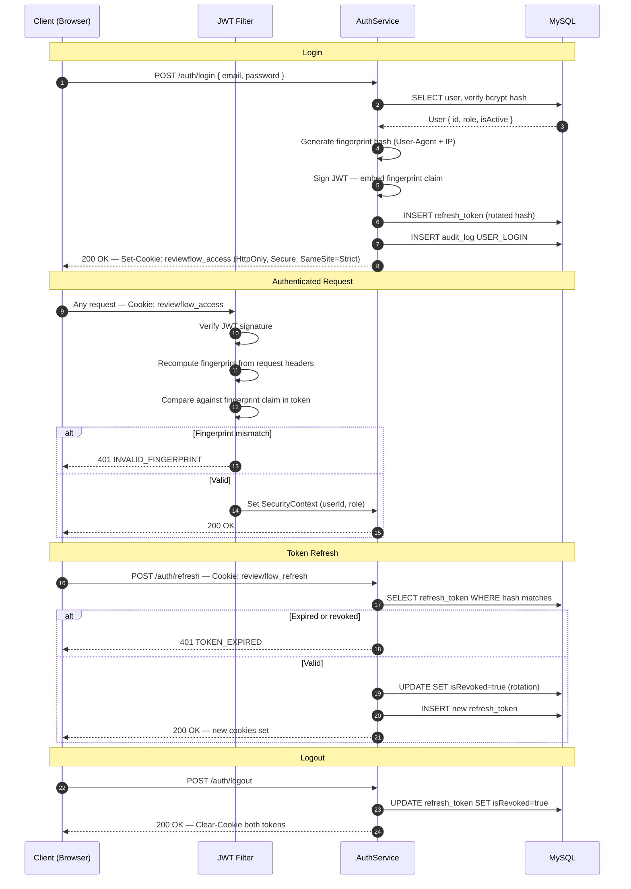
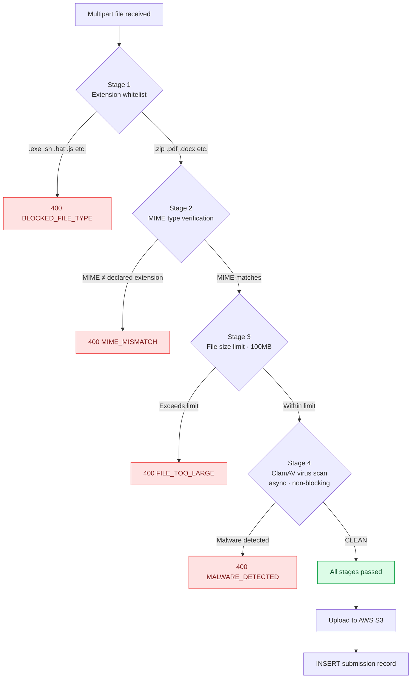
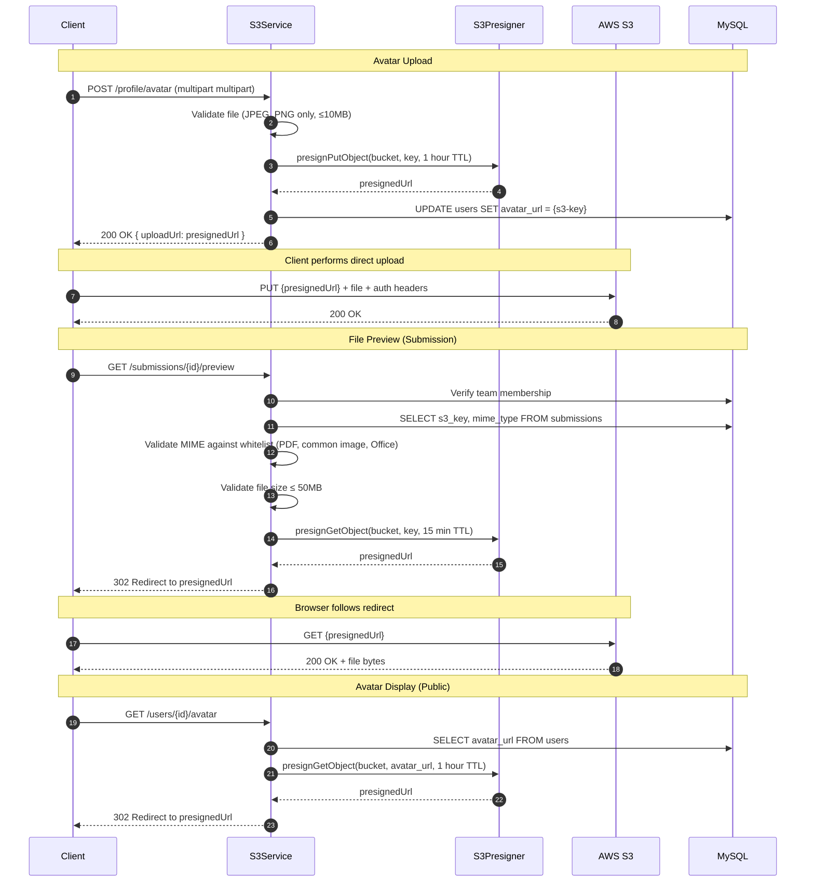
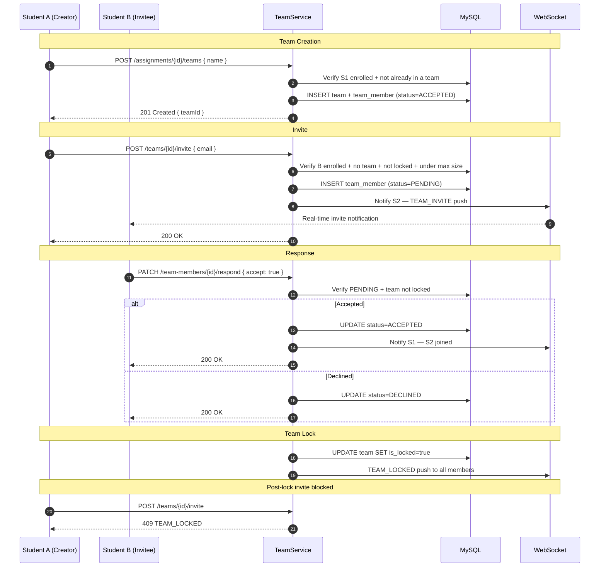
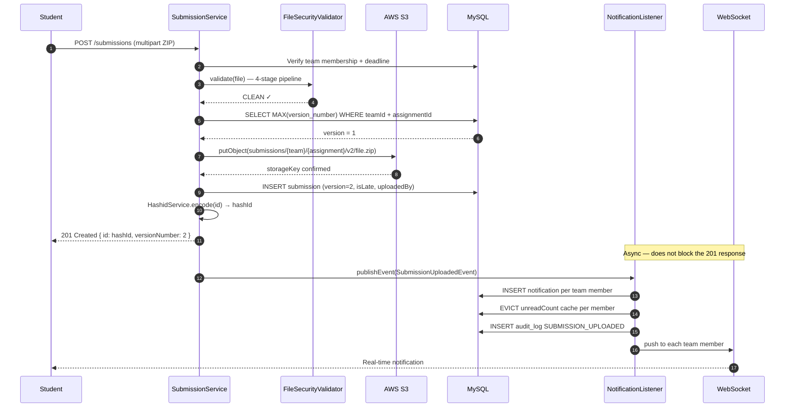
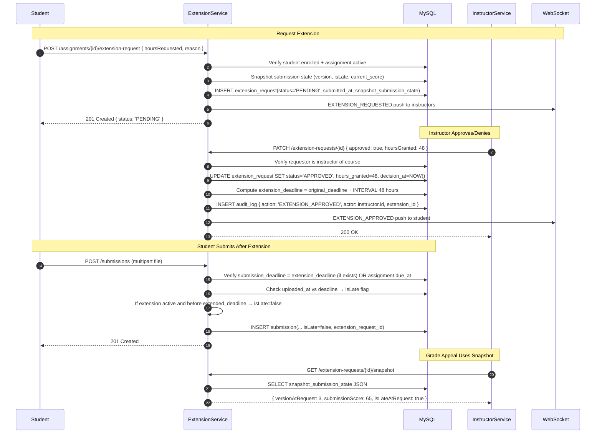
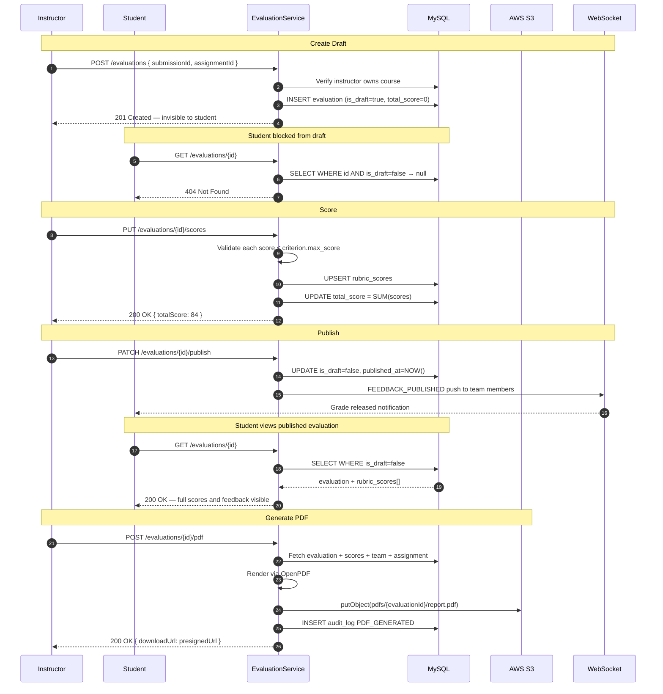
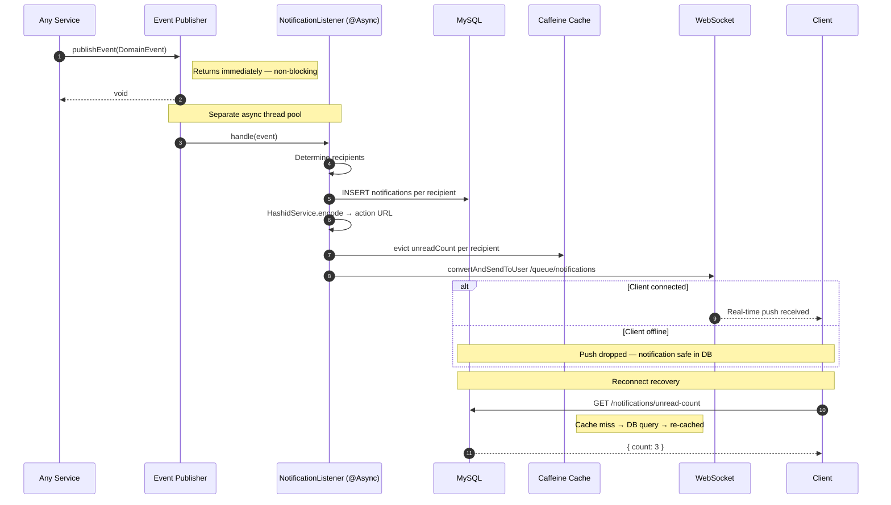
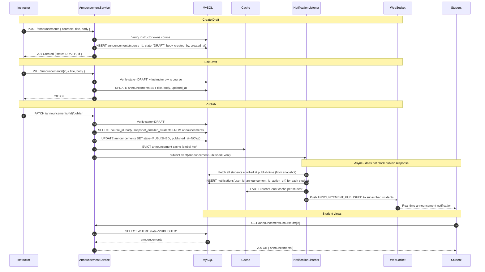
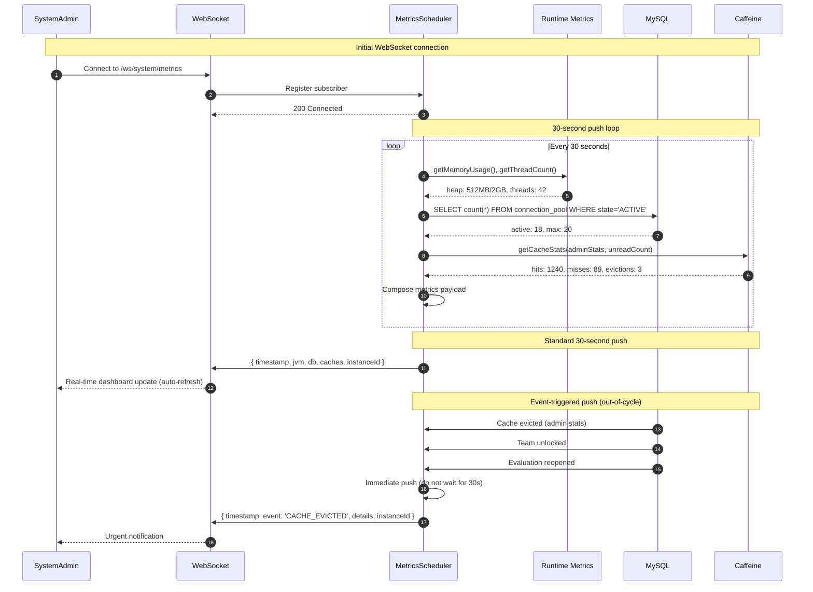

# ReviewFlow — Architecture & System Flows

This document covers all system flows, diagrams, and structural details.  
For the project overview, setup, and API reference see [README.md](./README.md).  
For design decisions and tradeoff reasoning see [DECISIONS.md](./DECISIONS.md).

---

## Contents

1. [Authentication Flow](#1-authentication-flow)
2. [File Security Pipeline](#2-file-security-pipeline)
3. [S3 & File Access](#3-s3--file-access)
4. [Team Formation & Invite Flow](#4-team-formation--invite-flow)
5. [Submission Pipeline](#5-submission-pipeline)
6. [Submission Dual-Path Logic](#6-submission-dual-path-logic)
7. [Assignment Extensions State Machine](#7-assignment-extensions-state-machine)
8. [Evaluation Pipeline](#8-evaluation-pipeline)
9. [Grade Export Pipeline](#9-grade-export-pipeline)
10. [Notification Async Flow](#10-notification-async-flow)
11. [Event-Driven Architecture](#11-event-driven-architecture)
12. [Announcement Broadcast](#12-announcement-broadcast)
13. [Caching Strategy](#13-caching-strategy)
14. [Role Hierarchy](#14-role-hierarchy)
15. [Security Model](#15-security-model)
16. [Monitoring & Observability](#16-monitoring--observability)
17. [System Admin Real-Time Metrics](#17-system-admin-real-time-metrics)
18. [Data Model](#18-data-model)
19. [Failure Scenarios](#19-failure-scenarios)
20. [Known Limitations](#20-known-limitations)
21. [Architecture Evolution Path](#21-architecture-evolution-path)

---

## 1. Authentication Flow

<!-- Paste Eraser diagram image URL below -->

> 📌 _Diagram — Authentication Flow_



**How it works:**

- Login verifies the bcrypt password hash, generates a device fingerprint, and sets two HTTP-only cookies — access token and refresh token
- Every authenticated request is fingerprint-validated — a token stolen from another device is rejected at the filter level
- Refresh tokens are single-use — each refresh rotates to a new token and revokes the old one
- Logout revokes the refresh token in the database, invalidating the session server-side

---

## 2. File Security Pipeline

<!-- Paste Eraser diagram image URL below -->

> 📌 _Diagram — File Security Pipeline_



**How it works:**

- Stages run in cheapest-first order — extension check is instant, ClamAV scan is last
- A file that fails any stage is rejected immediately; subsequent stages are not run
- ClamAV runs asynchronously so the validation thread is never blocked waiting for the scan result
- Fail-open in local/dev (ClamAV not required), fail-closed in production (uploads rejected if ClamAV is unavailable)

---

## 3. S3 & File Access

> 📌 _Diagram — S3 Presigner Flow (Avatars + File Preview)_



**How it works:**

- Avatar uploads use **direct S3 upload via presigned PUT URLs** — the client uploads directly to S3, not through the API
- Upload presigner generates 1-hour TTL URLs; avatar presigner generates 1-hour URLs for public display
- File preview presigner generates 15-minute TTL URLs; timeframe limits exposure window but permits re-access within the window
- MIME type whitelist enforces safe preview types — PDF, common images (JPEG, PNG, GIF, WebP), Office docs (DOCX, XLSX)
- File size gate prevents large files from being previewed — 50MB limit; larger files are rejected before presigner is called
- Presigner upgrade path: `S3Presigner` → (future) CloudFront SDK as traffic scales and CDN caching becomes cost-justified
- References: [PRD-02 Profile Pictures](../Features/PRD_02_profile_pictures.md), [PRD-07 File Preview](../Features/PRD_07_file_preview.md), [PRD S3 Storage](../Features/PRD_S3_storage.md)

---

## 4. Team Formation & Invite Flow

<!-- Paste Eraser diagram image URL below -->

> 📌 _Diagram — Team Formation & Invite Flow_



**How it works:**

- Team member status follows a defined lifecycle: `PENDING → ACCEPTED | DECLINED`
- All guard checks run before the `INSERT` — enrollment, existing team, team size, lock status
- Once locked, a team cannot accept new members regardless of size
- Lock can be triggered manually by an instructor or automatically by the scheduler at `team_lock_at`

---

## 5. Submission Pipeline

<!-- Paste Eraser diagram image URL below -->

> 📌 _Diagram — Submission Pipeline_



**How it works:**

- Submissions are versioned — no overwrite, full history preserved per team per assignment
- `isLate` is computed at write time by comparing `uploaded_at` against `assignment.due_at`
- The 201 response returns before async notification processing completes — upload is never delayed by notification delivery
- All external IDs in the response are Hashid-encoded — the raw database integer is never exposed

---

## 6. Submission Dual-Path Logic

Submissions support two distinct submission types — **Individual** and **Team** — enforced at the data model and query layers. A single assignment cannot have mixed submission types; the type is set at assignment creation and is immutable. The query layer branches based on `submission_type` before accessing `teamId` or `studentId`.

```
submission_type = 'INDIVIDUAL' OR 'TEAM' (enum, immutable per assignment)

If INDIVIDUAL:
  - submissions.student_id is populated; submissions.team_id is NULL
  - Query: SELECT * FROM submissions WHERE assignment_id = ? AND submission_type = 'INDIVIDUAL' AND student_id = ?

If TEAM:
  - submissions.team_id is populated; submissions.student_id is NULL
  - Query: SELECT * FROM submissions WHERE assignment_id = ? AND submission_type = 'TEAM' AND team_id = ?
```

**Path branching in SubmissionService:**

```
POST /assignments/{id}/submissions:
  1. SELECT assignment WHERE id — verify exists and fetch submission_type
  2. IF submission_type == 'INDIVIDUAL':
       - Verify: current user enrolled in course
       - Check: no existing INDIVIDUAL submission by this user for this assignment
       - CREATE: submissions(assignment_id, student_id, submission_type='INDIVIDUAL', uploaded_by)
     ELSE IF submission_type == 'TEAM':
       - Verify: current user enrolled + in a team for this assignment
       - Check: team not locked + team has ≤ deadline + no existing TEAM submission by team
       - CREATE: submissions(assignment_id, team_id, submission_type='TEAM', uploaded_by)
  3. Publish event to NotificationListener — membership context determines recipients
```

**Why separate columns?**

- Prevents NULL queries (`student_id IS NULL` is always true for team submissions, noise in query plans)
- `ON DELETE CASCADE` constraints differ: student deletion cascades only INDIVIDUAL submissions, team deletion cascades only TEAM submissions
- Database index strategy: `submissions(assignment_id, submission_type, student_id)` for individual path, `submissions(assignment_id, submission_type, team_id)` for team path

**Evaluation & Grade visibility:**

- Individual submissions → grades visible to that student only
- Team submissions → grades visible to all team members
- Query: `SELECT evaluations WHERE submission_id AND submission_type='TEAM'` → JOIN to `team_members` to determine access

References: [PRD-01 Submission Type](../Features/PRD_01_submission_type.md)

---

## 7. Assignment Extensions State Machine

> 📌 _Diagram — Extension Request Lifecycle_



**Extension State Transitions:**

- `PENDING` → `APPROVED` | `DENIED` (terminal once decided)
- `APPROVED` → `COMPLETED` (when student submits during extension window) | `USED` (manually marked by instructor)
- If extension requested but decision never made, defaults to deadline of original `assignment.due_at`

**Key design points:**

- **Snapshot capture** on extension request preserves submission state at request time (version number, late status, any partial score)
- **Snapshot use case**: grade appeals — instructor reviews snapshot of submission state at time the extension was requested, then compares to final grade
- **Deadline override**: `submission_deadline = CASE WHEN extension_request_id AND status='APPROVED' THEN extension_deadline ELSE assignment.due_at END`
- **Immutability**: extension_request rows are never updated after decision, only audit-logged

References: [PRD-05 Assignment Extensions](../Features/PRD_05_assignment_extensions.md)

---

## 8. Evaluation Pipeline

<!-- Paste Eraser diagram image URL below -->

> 📌 _Diagram — Evaluation Pipeline_



**How it works:**

- Draft evaluations return `404` to students — not `403`. Students cannot know an evaluation exists until it is published
- Score validation enforces rubric maximums at write time — invalid scores are rejected before saving
- Publishing is a one-way transition — once published, an evaluation is permanently visible to the team
- PDF is generated on demand, stored in S3, and returned as a pre-signed download URL

**How it works:**

- Draft evaluations return `404` to students — not `403`. Students cannot know an evaluation exists until it is published
- Score validation enforces rubric maximums at write time — invalid scores are rejected before saving
- Publishing is a one-way transition — once published, an evaluation is permanently visible to the team
- PDF is generated on demand, stored in S3, and returned as a pre-signed download URL

---

## 9. Grade Export Pipeline

> 📌 _Diagram — CSV Export Flow_

```mermaid
sequenceDiagram
    autonumber
    participant I as Instructor
    participant GES as GradeExportService
    participant DB as MySQL
    participant CSV as CSVBuilder
    participant C as Client

    I->>GES: GET /assignments/{id}/grades/export
    GES->>DB: Verify instructor owns course
    GES->>DB: SELECT submission(id, team_id, student_id, version, uploaded_at, is_late)
    GES->>DB: LEFT JOIN team ON submission.team_id
    GES->>DB: LEFT JOIN team_members ON team.id
    GES->>DB: LEFT JOIN evaluations ON submission.id
    GES->>DB: LEFT JOIN rubric_scores ON evaluations.id
    DB-->>GES: Row set with evaluation + team context

    GES->>CSV: iterateRows() — transform to CSV format
    CSV->>CSV: header = [ 'Student Name', 'Email', 'Submission Date', 'Is Late', 'Total Score', ... ]
    CSV->>CSV: for each Row:
    CSV->>CSV: if Row.team_id != null: name = Row.team_name (team path)
    CSV->>CSV: else: name = Row.student_name (individual path)
    CSV->>CSV: defensivePrefix(Row.TotalScore) — prepend TAB if starts with =,+,-,@
    CSV->>CSV: row = [ name, email, submission_date, is_late, defensivePrefix(score) ]
    CSV-->>GES: CSV bytes

    GES-->>I: 200 OK
    Note over I,Client: Content-Type: text/csv
    Note over I,Client: Content-Disposition: attachment; filename=grades.csv
    I->>C: CSV file bytes

    Note over C: Excel opens CSV, displays grades
```

**CSV Export Details:**

- **Single SELECT with LEFT JOINs** — no N+1 queries; one pass through database fetches all submission and evaluation data
- **Team vs Individual branching** — CSV row name is `team_name` if team submission, `student_name` if individual
- **CSV injection defense** — if `total_score` starts with `=`, `+`, `-`, or `@`, prepend a TAB character (Excel will treat as text, not formula)
- **No JSON wrapper** — HTTP response is raw CSV bytes; clients open directly in Excel, no parsing required
- **Consistent with spec**: [PRD-06 Grade Export](../Features/PRD_06_grade_export.md)

---

## 10. Notification Async Flow

<!-- Paste Eraser diagram image URL below -->

> 📌 _Diagram — Notification Async Flow_



**How it works:**

- `publishEvent()` returns immediately — the calling service thread is never blocked by notification logic
- DB write happens before WebSocket push — a notification is never lost because of a delivery failure
- WebSocket delivery is best-effort — if the client is offline, the push is dropped silently
- Clients recover full unread state on reconnect by polling `GET /notifications/unread-count`, which re-hydrates the cache from the database

**How it works:**

- `publishEvent()` returns immediately — the calling service thread is never blocked by notification logic
- DB write happens before WebSocket push — a notification is never lost because of a delivery failure
- WebSocket delivery is best-effort — if the client is offline, the push is dropped silently
- Clients recover full unread state on reconnect by polling `GET /notifications/unread-count`, which re-hydrates the cache from the database

---

## 11. Event-Driven Architecture

ReviewFlow uses Spring `ApplicationEventPublisher` for intra-process async messaging. All significant domain events (submissions, extensions, evaluations) are published synchronously, then handled asynchronously by `@EventListener` methods. This decouples the upstream service (submission upload) from downstream concerns (notifications, audit logging).

**Event Publishing Flow:**

```
Service Action (e.g., submission upload)
  ↓
ApplicationEventPublisher.publishEvent(DomainEvent)
  ↓ (returns immediately — non-blocking)
EventListener pool receives event
  ↓
Multiple listeners process independently:
  → NotificationListener: INSERT notifications, evict cache, push WebSocket
  → AuditListener: INSERT audit_log
  → AnalyticsListener: publish to Kafka (future)
```

**Event Types & Listeners:**
| Event | Listener | Action |
|---|---|---|
| `SubmissionUploadedEvent` | NotificationListener | Notify team members, evict cache |
| `SubmissionUploadedEvent` | AuditListener | Log SUBMISSION_UPLOADED action |
| `EvaluationPublishedEvent` | NotificationListener | Notify team members — grades released |
| `ExtensionRequestedEvent` | NotificationListener | Notify instructors of request |
| `ExtensionApprovedEvent` | NotificationListener | Notify student of decision |
| `AnnouncementPublishedEvent` | NotificationListener | Notify enrolled students |

**Executor Pool Configuration:**

- Core threads: 2 (minimum to handle concurrent events)
- Max threads: 10 (ceiling before degradation — signals infrastructure bottleneck)
- Queue: `LinkedBlockingQueue(100)` — unbounded with 100 task buffer
- Policy: `CallerRunsPolicy` — if queue full, event processing runs on calling thread (blocking, but prevents loss)

**Failure Handling & DLQ:**

- Event listener exceptions are logged but do not propagate — a failed notification does not block the submission response
- Failed event records are optionally inserted into `failed_events` table (DLQ pattern) for manual replay:

```sql
CREATE TABLE failed_events (
  id BIGINT PRIMARY KEY,
  event_type VARCHAR(255),
  event_payload JSON,
  error_message TEXT,
  created_at TIMESTAMP,
  replayed_at TIMESTAMP NULL
)
```

References: [PRD-03 Email Notifications](../Features/PRD_03_email_notifications.md)

---

## 12. Announcement Broadcast

> 📌 _Diagram — Announcement Draft→Publish State Machine_



**Announcement State Machine:**

- `DRAFT` — created but not visible to any student; only creator can read/edit
- `PUBLISHED` — immutable visibility state; visible to all students enrolled at publish time and onward
- No `ARCHIVED` or soft-delete in this phase — published announcements are permanent

**Broadcast Semantics:**

- **"Enrolled at publish time"** — notifications are sent only to students currently enrolled when instructor clicks publish
- Late enrollees do not receive a notification but can read the published announcement via GET /announcements
- Unenrolled students lose visibility but retain notification records (soft delete: `is_active=false`)

**Cache Invalidation:**

- On publish, evict the global announcement cache (all announcements for the course)
- On draft creation/edit, do NOT evict — draft is only visible to instructor

---

## 13. Caching Strategy

Five Caffeine caches with deliberately chosen TTLs. The abstraction is Spring Cache — replacing Caffeine with Redis requires changing only `CacheConfig`, no annotation changes across any service.

| Cache               | TTL    | Cache key      | Eviction triggers                               |
| ------------------- | ------ | -------------- | ----------------------------------------------- |
| `adminStats`        | 60 s   | `'global'`     | Any user, course, or submission change          |
| `unreadCount`       | 30 s   | `userId`       | Notification create, read, or delete            |
| `userCourses`       | 5 min  | `userId`       | Enroll, unenroll, course archive                |
| `assignmentDetail`  | 10 min | `assignmentId` | Assignment update, rubric change                |
| `courseGradeGroups` | 5 min  | `courseId`     | Group create/update/delete and assignment moves |

Boundaries were chosen deliberately — only data that is read frequently, changes infrequently, and is safe to serve slightly stale qualifies. Write endpoints never cache; they only evict.

**Cache Refresh Strategy:**

- High-traffic caches (`adminStats`, `unreadCount`) use Caffeine's `refreshAfterWrite` with async background reload
- Background loader queries database on secondary thread; client receives stale value immediately, then cache updates after background refresh completes
- Prevents thundering herd on cache expiration — multiple concurrent requests do not all hit the database at once

**Manual Eviction Policy:**

- Per-cache minimum 60-second gate between manual evictions (debounce rapid changes)
- Example: if an assignment's rubric is updated 3 times in 5 seconds, cache evicts only once
- Prevents excessive database hits from rapid upstream changes

---

## 14. Role Hierarchy

ReviewFlow enforces role-based access control via Spring Security's role hierarchy. Roles are hierarchical — a higher role grants all permissions of lower roles.

```
ROLE_SYSTEM_ADMIN (system-wide permissions)
  ↓
ROLE_ADMIN (institution admin)
  ↓
ROLE_INSTRUCTOR (instructor)
  ↓
ROLE_STUDENT (student)
```

**Role Access Paths:**
| Path | Required Role | Notes |
|---|---|---|
| `/admin/**` | ROLE_ADMIN | Course creation, user management, course archive |
| `/system/**` | ROLE_SYSTEM_ADMIN | Real-time metrics, instance diagnostics, force logout, audit log queries |
| `/courses/{id}/announcements` (create) | ROLE_INSTRUCTOR | Create and publish announcements (within owned course) |
| `/assignments/{id}/extensions` (approve) | ROLE_INSTRUCTOR | Approve/deny extension requests |
| `/assignments/{id}/grades/export` | ROLE_INSTRUCTOR | Export grades as CSV |
| `/submissions/{id}` (read) | ROLE_STUDENT or team member | Own submissions only, or team submissions if member |
| `/evaluations/{id}` (read before publish) | ROLE_INSTRUCTOR | Draft evaluations invisible to students (404) |

**Spring Security Configuration:**

```java
http.authorizeHttpRequests()
  .requestMatchers("/system/**").hasRole("SYSTEM_ADMIN")
  .requestMatchers("/admin/**").hasRole("ADMIN")
  .requestMatchers("/instructor/**").hasRole("INSTRUCTOR")
  // Student endpoints below
  .anyRequest().authenticated()

http.sessionManagement()
  .sessionFixationProtection(SessionFixationProtectionStrategy.MIGRATE_SESSION)
```

**Multi-role Users:**

- A user can hold multiple roles (e.g., instructor in Course A, student taking Course B)
- Role evaluation is per-deployment; a user's role set is stored in the `user_roles` table
- No dynamic role switching at runtime — role is fixed at authentication time and embedded in JWT

References: [PRD-09 System Admin](../Features/PRD9-SystemAdmin.md)

---

## 15. Security Model

| Concern          | Implementation                                                                                             |
| ---------------- | ---------------------------------------------------------------------------------------------------------- |
| Authentication   | JWT in HTTP-only cookies — XSS cannot read the token                                                       |
| Token binding    | Fingerprint hash (User-Agent + IP) embedded in JWT — stolen tokens from another device are rejected        |
| Token lifetime   | Short-lived access token + rotating refresh token — each refresh token is single-use                       |
| Authorization    | STUDENT / INSTRUCTOR / ADMIN enforced at controller and service layers                                     |
| File safety      | 4-stage `FileSecurityValidator` — extension, MIME, size, ClamAV                                            |
| ID safety        | Hashids on all external IDs — sequential integers never exposed                                            |
| Rate limiting    | Per-IP sliding window on auth endpoints                                                                    |
| Audit trail      | Append-only `audit_log` — all significant write actions recorded with actor, IP, and metadata              |
| Security headers | `X-Content-Type-Options`, `X-Frame-Options`, `Content-Security-Policy`, `Referrer-Policy` on all responses |

| Concern          | Implementation                                                                                             |
| ---------------- | ---------------------------------------------------------------------------------------------------------- |
| Authentication   | JWT in HTTP-only cookies — XSS cannot read the token                                                       |
| Token binding    | Fingerprint hash (User-Agent + IP) embedded in JWT — stolen tokens from another device are rejected        |
| Token lifetime   | Short-lived access token + rotating refresh token — each refresh token is single-use                       |
| Authorization    | STUDENT / INSTRUCTOR / ADMIN enforced at controller and service layers                                     |
| File safety      | 4-stage `FileSecurityValidator` — extension, MIME, size, ClamAV                                            |
| ID safety        | Hashids on all external IDs — sequential integers never exposed                                            |
| Rate limiting    | Per-IP sliding window on auth endpoints                                                                    |
| Audit trail      | Append-only `audit_log` — all significant write actions recorded with actor, IP, and metadata              |
| Security headers | `X-Content-Type-Options`, `X-Frame-Options`, `Content-Security-Policy`, `Referrer-Policy` on all responses |

---

## 16. Monitoring & Observability

ReviewFlow logs all significant operations to a structured audit trail and exposes system metrics via a metrics registry. Observability is built in — the system can be monitored in real-time without requiring external instrumentation.

**Structured Logging — LogstashEncoder**

- All application logs are encoded as JSON and sent to CloudWatch (or local file in dev)
- Format: `{ timestamp, level, logger, message, traceId, userId, coursId, action, metadata }`
- **Request Tracing**: Every request generates a unique `X-Trace-Id` (UUID); traceId is injected into MDC (Mapped Diagnostic Context)
- MDC value is automatically included in all log messages from that request thread — enables log correlation across services (multiline request trace)

**Metrics Collection — MeterRegistry**

- JVM Metrics: heap usage, thread count, garbage collection time
- Database Pool: active connections, idle connections, wait queue depth
- Cache Metrics: hits, misses, evictions per cache
- Custom Metrics: submission upload count, team formation count, evaluation publish count

**Audit Trail — Append-Only**

```sql
CREATE TABLE audit_log (
  id BIGINT PRIMARY KEY,
  action VARCHAR(255),        -- SUBMISSION_UPLOADED, GRADE_PUBLISHED, etc
  actor_id BIGINT,            -- user ID who triggered action
  actor_email VARCHAR(255),   -- email of actor (for offline analysis)
  actor_ip VARCHAR(45),       -- IP address of actor
  entity_type VARCHAR(255),   -- SUBMISSION, EVALUATION, TEAM, etc
  entity_id BIGINT,
  metadata JSON,              -- { submissionId, courseId, teamId, ... }
  created_at TIMESTAMP
)
```

- No UPDATE or DELETE on audit_log — rows are INSERTed only and are permanent
- Index: `(entity_type, entity_id, created_at)` for efficient entity history queries

**Log Sampling (Future)**

- At scale, JSON logs can become expensive to store and query
- Sampling strategy: log 100% of errors + rate-limited sample of success logs (e.g., 5% of normal operations)
- Sampling decision embedded in LoggerContext — can be toggled without code changes

References: [PRD-08 Logging & Monitoring](../Features/PRD_08_logging_monitoring.md)

---

## 17. System Admin Real-Time Metrics

> 📌 _Diagram — Real-Time Metrics Push Flow_



**Metrics Push Payload:**

```json
{
  "timestamp": "2026-03-30T14:23:45.123Z",
  "instanceId": "ip-10-0-1-45.ca-central-1.compute.internal",
  "jvm": {
    "heapUsed": 536870912,
    "heapMax": 2147483648,
    "threads": 42,
    "gcCount": 12,
    "gcTimeMs": 3450
  },
  "database": {
    "activeConnections": 18,
    "maxConnections": 20,
    "waitQueueDepth": 0,
    "queryCount": 45000,
    "slowQueryCount": 3
  },
  "cache": {
    "adminStats": { "hits": 1240, "misses": 89, "evictions": 3 },
    "unreadCount": { "hits": 3421, "misses": 156, "evictions": 12 }
  },
  "securityEvents": {
    "failedLoginAttempts": 2,
    "tokenValidationFailures": 0,
    "unauthorizedAccessAttempts": 1
  }
}
```

**Push Intervals & Triggers:**

- **Scheduled Push**: every 30 seconds (even if no changes)
- **Event-Triggered Push**: immediate (out-of-cycle) on:
  - Cache evicted
  - Force logout action executed
  - Team unlocked
  - Evaluation reopened
  - Critical security event (failed auth threshold exceeded)

**Instance Identifier:**

- `instanceId` included in payload to identify which instance pushed metrics (for multi-instance deployments)
- Format: AWS EC2 internal DNS name or container hostname
- Dashboard can filter/aggregate by instance

**Dashboard Features:**

- Real-time line graph: heap usage, thread count, active connections, cache hit ratio
- Alert thresholds: heap > 80%, thread pool saturated, connection pool waiting > 5
- Audit trail viewer: filter by action, actor, entity type, date range
- Event log: security events, failed operations, performance anomalies

References: [PRD-09 System Admin Real-Time Metrics](../Features/PRD9-SystemAdmin.md)

---

## 18. Data Model

Current migrations are V1-V24. All schema changes are managed through Flyway versioned migrations and `ddl-auto` is never used.

**Core entities:**

| Entity                         | New Columns                                                                                                      | Notes                                                                             |
| ------------------------------ | ---------------------------------------------------------------------------------------------------------------- | --------------------------------------------------------------------------------- |
| `users`                        | `avatar_url` (VARCHAR)                                                                                           | Roles: STUDENT, INSTRUCTOR, ADMIN, SYSTEM_ADMIN. Soft delete via `is_active`      |
| `courses`                      | —                                                                                                                | Created by instructors, archived not deleted                                      |
| `course_enrollments`           | —                                                                                                                | Many-to-many: students ↔ courses                                                  |
| `course_instructors`           | —                                                                                                                | Many-to-many: instructors ↔ courses                                               |
| `assignments`                  | `submission_type` (ENUM: INDIVIDUAL\|TEAM\|INSTRUCTOR_GRADED), `max_score` (nullable)                            | Belongs to course, has publish flag, lock deadline, and immutable submission_type |
| `rubric_criteria`              | —                                                                                                                | Per-assignment scoring criteria with `max_score` and `display_order`              |
| `teams`                        | `is_locked` (BOOLEAN)                                                                                            | Per-assignment, locked prevents membership changes                                |
| `team_members`                 | —                                                                                                                | Status lifecycle: `PENDING → ACCEPTED \| DECLINED`                                |
| `submissions`                  | `submission_type` (ENUM), `student_id` (nullable), `team_id` (nullable), `extension_request_id` (nullable)       | Versioned per team or student + assignment — dual-path query logic                |
| `evaluations`                  | —                                                                                                                | Per submission, `is_draft` gate controls student visibility                       |
| `rubric_scores`                | —                                                                                                                | Line-item scores per criterion per evaluation                                     |
| `announcements`                | `state` (ENUM: DRAFT\|PUBLISHED), `published_at` (TIMESTAMP)                                                     | Per course, immutable once published                                              |
| `extension_requests`           | `status` (ENUM: PENDING\|APPROVED\|DENIED), `snapshot_submission_state` (JSON), `extension_deadline` (TIMESTAMP) | Capture submission snapshot at request time for appeals                           |
| `notifications`                | —                                                                                                                | Per user, `related_entity_type` + `related_entity_id` for deep-linking            |
| `refresh_tokens`               | —                                                                                                                | Hashed, single-use, with `is_revoked` flag                                        |
| `audit_log`                    | —                                                                                                                | Append-only, actor email + IP + action + metadata                                 |
| `failed_events` (optional DLQ) | `event_type`, `event_payload`, `error_message`, `replayed_at`                                                    | Dead-letter queue for failed event listeners                                      |

**Indexes for dual-path submissions:**

```sql
CREATE INDEX idx_submissions_individual
  ON submissions(assignment_id, submission_type, student_id)
  WHERE submission_type = 'INDIVIDUAL';

CREATE INDEX idx_submissions_team
  ON submissions(assignment_id, submission_type, team_id)
  WHERE submission_type = 'TEAM';
```

**Entity Relationship Diagram (simplified):**

```
users (1) ←→ (N) course_enrollments (N) ←→ (1) courses
  ↓                                            ↓
 (1)                                          (N)
  ↓                                            ↓
audit_log                                 assignments
  ↓                                            ├→ (N) rubric_criteria
  ↓                                            ├→ (N) teams
  ↓                                            ├→ (N) extension_requests
  ↓                                            └→ (N) announcements
  ↓
refresh_tokens ── (1) users (N) ── notifications

submissions:
  ├→ (1) assignments
  ├→ (1) teams (nullable)
  ├→ (1) users (nullable — student_id)
  └→ (N) evaluations
         └→ (N) rubric_scores
```

---

## 19. Failure Scenarios

### Authentication

- Invalid credentials → rate-limited rejection, generic error message (no hint of which field failed)
- Missing or expired JWT → blocked at filter, never reaches a controller
- Fingerprint mismatch → 401, token treated as stolen from another device
- Refresh token reuse → session invalidated (rotation enforced)

### Authorization

- Student requesting a draft evaluation → 404 (existence not revealed, not 403)
- Instructor accessing a course they do not own → 403
- Student accessing another team's submission → 403
- Invite sent to a locked team → 409 TEAM_LOCKED

### File upload

- Blocked extension → 400 BLOCKED_FILE_TYPE (Stage 1 — cheapest check first)
- MIME type mismatch → 400 MIME_MISMATCH (Stage 2)
- File too large → 400 FILE_TOO_LARGE (Stage 3)
- Malware detected → 400 MALWARE_DETECTED (Stage 4)

### Infrastructure

- WebSocket disconnect → notification persists in DB, client recovers on reconnect
- ClamAV unavailable → fail-open locally, fail-closed in production
- S3 upload failure → submission record not persisted (transaction rolled back)
- Notification delivery failure → DB record preserved, never lost

---

## 20. Known Limitations

| Limitation                                        | Reason                                                                      |
| ------------------------------------------------- | --------------------------------------------------------------------------- |
| No distributed transaction management             | Monolith scope — all operations share one DB connection and ACID guarantees |
| No global rate limiting across nodes              | Per-instance in-memory only — requires Redis before horizontal scale        |
| WebSocket requires sticky sessions for multi-node | Needs a Redis broker before horizontal scale is viable                      |
| Cache is not shared across nodes                  | In-memory Caffeine — acceptable until horizontal scale is needed            |
| No automated grading pipeline                     | Manual instructor grading only — by design for this phase                   |

---

## 21. Architecture Evolution Path

ReviewFlow is structured for service extraction. Domain boundaries are already defined — the codebase is organized by domain, not by technical layer. Extraction becomes a matter of deployment topology, not refactoring.

**Services ready for extraction:**

| Service               | Extraction trigger                            |
| --------------------- | --------------------------------------------- |
| `FileService`         | Upload throughput needs independent scaling   |
| `NotificationService` | WebSocket needs a dedicated broker            |
| `EvaluationService`   | Grading workflows need independent deployment |
| `AuthService`         | SSO or multi-tenant auth is required          |

**Infrastructure prerequisites before any extraction:**

- Kafka or RabbitMQ to replace Spring `ApplicationEvent` for cross-service communication
- Redis for distributed cache and WebSocket broker
- API Gateway for routing, auth delegation, and cross-cutting concerns
