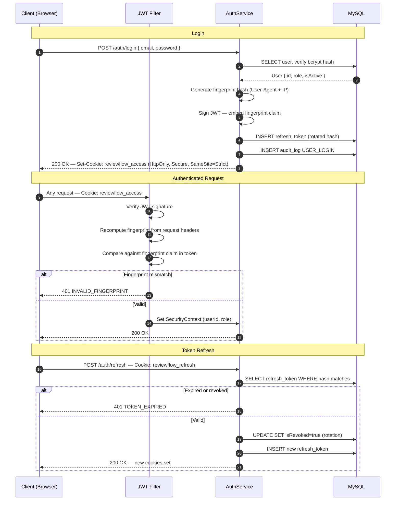
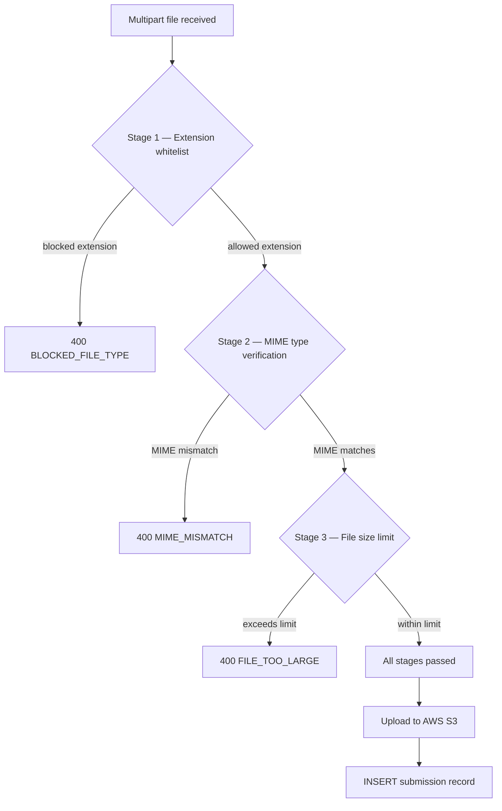
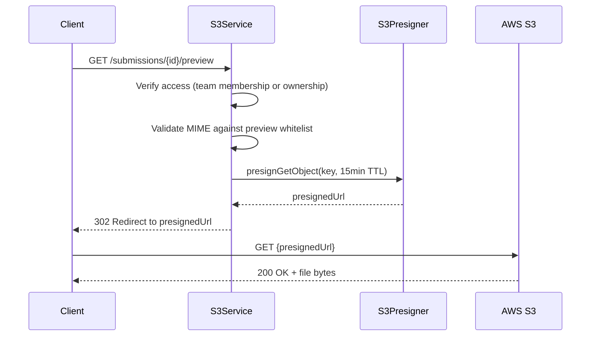
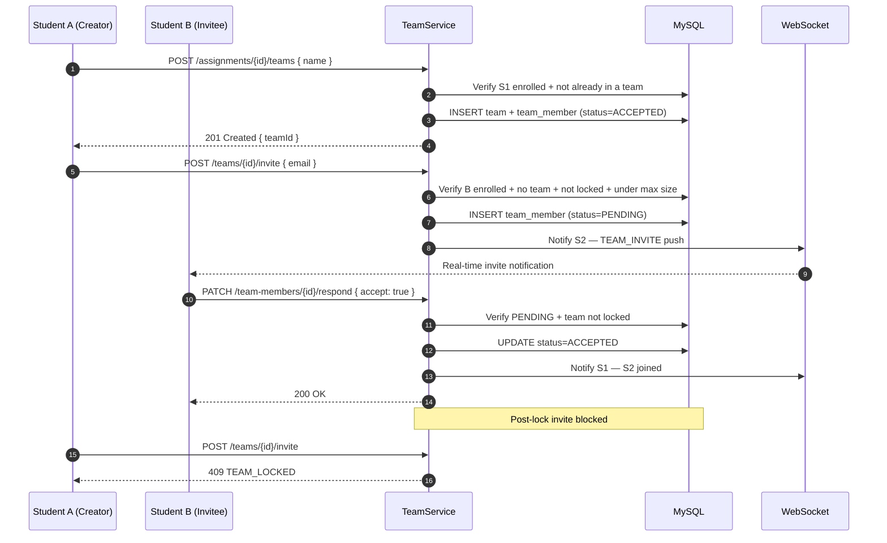
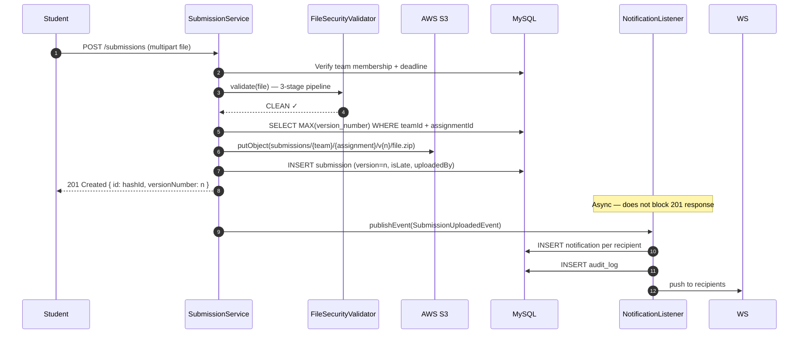
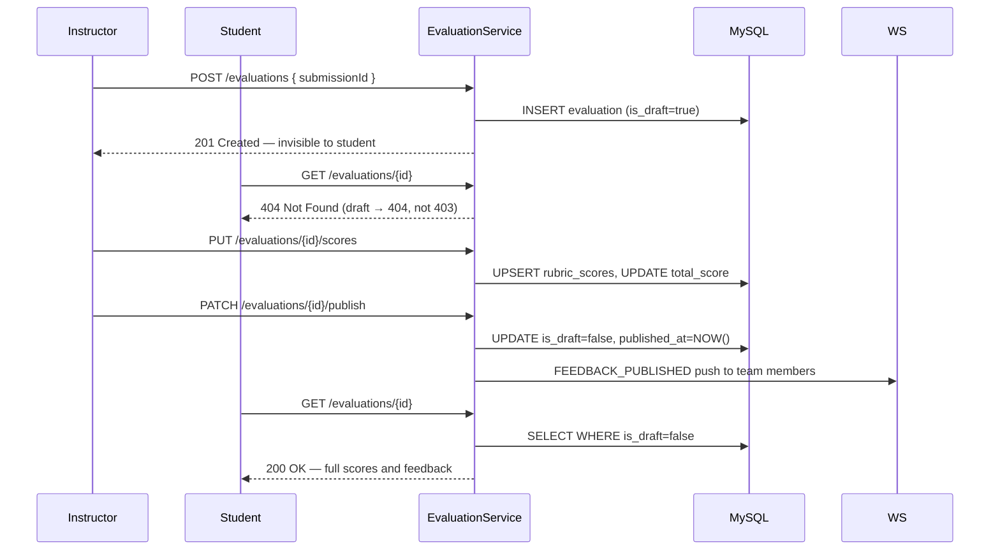
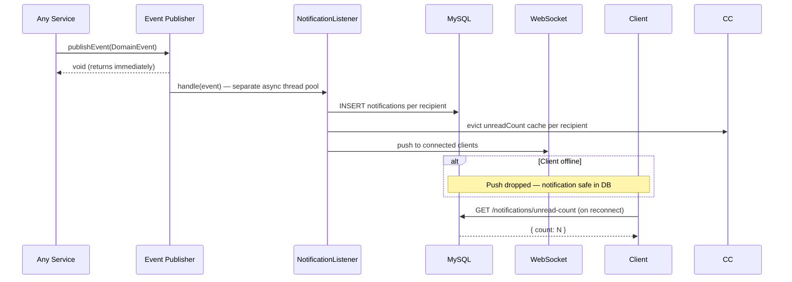

# ReviewFlow — Architecture & System Flows

For the project overview and setup see [README.md](./README.md).
For design decisions and tradeoff reasoning see [DECISIONS.md](./DECISIONS.md).

---

## Contents

1. [Authentication Flow](#1-authentication-flow)
2. [File Security Pipeline](#2-file-security-pipeline)
3. [S3 & File Access](#3-s3--file-access)
4. [Team Formation & Invite Flow](#4-team-formation--invite-flow)
5. [Submission Pipeline](#5-submission-pipeline)
6. [Submission Dual-Path Logic](#6-submission-dual-path-logic)
7. [Assignment Extensions State Machine](#7-assignment-extensions-state-machine)
8. [Evaluation Pipeline](#8-evaluation-pipeline)
9. [Grade Export Pipeline](#9-grade-export-pipeline)
10. [Notification Async Flow](#10-notification-async-flow)
11. [Event-Driven Architecture](#11-event-driven-architecture)
12. [Announcement Broadcast](#12-announcement-broadcast)
13. [Caching Strategy](#13-caching-strategy)
14. [Redis — Distributed State](#14-redis--distributed-state)
15. [Role Hierarchy](#15-role-hierarchy)
16. [Security Model](#16-security-model)
17. [Monitoring & Observability](#17-monitoring--observability)
18. [System Admin Real-Time Metrics](#18-system-admin-real-time-metrics)
19. [Data Model](#19-data-model)
20. [CI/CD Pipeline](#20-cicd-pipeline)
21. [Infrastructure](#21-infrastructure)
22. [Failure Scenarios](#22-failure-scenarios)
23. [Known Limitations](#23-known-limitations)
24. [Architecture Evolution Path](#24-architecture-evolution-path)

---

## 1. Authentication Flow



---

## 2. File Security Pipeline



**Three stages only — ClamAV removed.** The operational burden of running ClamAV (dedicated service, socket connection, scan latency on a t3.micro) was disproportionate to the threat model for an authenticated academic platform. See [DECISIONS.md — ClamAV removal](#).

Stages run cheapest-first — extension check is instant, MIME check requires reading file headers. A file that fails any stage is rejected immediately.

---

## 3. S3 & File Access

**Avatar URLs — stored at upload, no SDK calls at read time:**

```
Upload:
  UserService.uploadAvatar()
    → builds URL: https://{bucket}.s3.{region}.amazonaws.com/avatars/{hashedUserId}/avatar.{ext}?v={epochMillis}
    → persists to users.avatar_url
    → zero presign calls

Read (roster, profile, discussion, messaging):
  return user.getAvatarUrl()  ← direct DB column read
  → zero S3 SDK calls at read time
  → zero presign overhead regardless of roster size (800 students = 0 S3 calls)
```

**Submissions and PDFs — pre-signed URLs (15-minute TTL):**



---

## 4. Team Formation & Invite Flow



---

## 5. Submission Pipeline



---

## 6. Submission Dual-Path Logic

```
submission_type = INDIVIDUAL | TEAM | INSTRUCTOR_GRADED (enum, immutable per assignment)

INDIVIDUAL path:
  submissions.student_id = userId
  submissions.team_id    = NULL
  Query: WHERE assignment_id = ? AND student_id = ?

TEAM path:
  submissions.team_id    = teamId
  submissions.student_id = NULL
  Query: WHERE assignment_id = ? AND team_id = ?

INSTRUCTOR_GRADED:
  No student file submission — instructor enters score directly
  or bulk CSV upload
```

**Default:** `INDIVIDUAL` — safer failure mode. Forgetting to set type means students submit directly rather than hitting broken team formation flow.

**Immutability:** `submission_type` is locked once any team or submission exists for that assignment — `409 SUBMISSION_TYPE_LOCKED`.

---

## 7. Assignment Extensions State Machine

Extension requests follow: `PENDING → APPROVED | DENIED`

On approval:
- `extension_deadline = original_due_at + INTERVAL hours_granted HOUR`
- Student submits against `extension_deadline` — `isLate` computed against extended deadline
- Submission snapshot captured at request time for grade appeals

---

## 8. Evaluation Pipeline



**Draft returns `404` not `403`** — `403` would reveal the evaluation exists. Students see nothing until publish.

---

## 9. Grade Export Pipeline

Single `SELECT` with `LEFT JOIN`s — no N+1 queries. One pass through the database fetches all submission and evaluation data. CSV injection defense: values starting with `=`, `+`, `-`, `@` are prefixed with a TAB character.

---

## 10. Notification Async Flow



**DB-first guarantee:** notification is persisted before WebSocket push. Push failure never loses the notification.

---

## 11. Event-Driven Architecture

Spring `ApplicationEventPublisher` for intra-process async messaging. Services publish events synchronously; listeners handle side effects asynchronously.

| Event | Listener | Action |
|---|---|---|
| `SubmissionUploadedEvent` | NotificationListener | Notify recipients, evict cache |
| `SubmissionUploadedEvent` | AuditListener | LOG SUBMISSION_UPLOADED |
| `EvaluationPublishedEvent` | NotificationListener | Notify team — grades released |
| `EvaluationPublishedEvent` | PdfGenerationListener | Generate PDF async |
| `ExtensionRequestedEvent` | NotificationListener | Notify instructors |
| `ExtensionApprovedEvent` | NotificationListener | Notify student |
| `AnnouncementPublishedEvent` | NotificationListener | Notify enrolled students |
| `GradePublishedEvent` | GradeAggregateListener | Recompute Redis grade blob |

**Thread pools:**
- `notificationTaskExecutor` — core 2 / max 10
- `emailTaskExecutor` — core 2 / max 10

---

## 12. Announcement Broadcast

Announcements follow `DRAFT → PUBLISHED` (one-way, immutable).
- Draft: invisible to students, editable by creator
- Published: visible to all enrolled students, permanently immutable
- Notifications sent only to students enrolled at publish time

---

## 13. Caching Strategy

### Caffeine — Spring @Cacheable (per-JVM, in-process)

| Cache | TTL | Key | Eviction triggers |
|---|---|---|---|
| `adminStats` | 60s | `'global'` | Any user/course/submission change |
| `unreadCount` | 30s | `userId` | Notification create, read, delete |
| `userCourses` | 5min | `userId` | Enroll, unenroll, archive |
| `assignmentDetail` | 10min | `assignmentId` | Assignment update, rubric change |
| `courseGradeGroups` | 5min | `courseId` | Group create/update/delete |
| `courseModules` | 5min | `courseId` | Module create/update/delete/reorder |
| `gradeOverview` | 5min | `courseId:studentId` | Grade published, weight changed |
| `classStatistics` | 10min | `courseId` | Any grade published in course |
| `courseMaterials` | 5min | `courseId` | Material create/update/delete |
| `courseDiscussions` | 5min | `courseId` | Discussion create/publish |
| `discussionParticipation` | 5min | `discussionId:userId` | Post created |
| `csvImports` | 10min | `importId` | CSV dry-run session |
| `oauthState` | 5min | `state` | OAuth PKCE flow |

### Redis — Distributed State (shared, always-on)

| Key Namespace | Purpose | Mechanism |
|---|---|---|
| `reviewflow:ratelimit:*` | Rate limiting | Bucket4j + Lettuce |
| `reviewflow:grade:aggregate:{courseId}:{studentId}` | Grade overview blobs | GradeAggregateService |
| `reviewflow:grade:stats:{courseId}` | Class statistics | GradeAggregateService |
| `reviewflow:job:{jobId}` | CSV import job progress | AsyncJobService |
| `reviewflow:import:lock:{courseId}` | Concurrent import prevention | AsyncJobService |
| `reviewflow:oauth:state:{state}` | OAuth CSRF state | OAuthService |
| `reviewflow:token:version:*` | Token invalidation | Conditional on `auth.token-version.store=redis` |
| `reviewflow:messaging:push` | WebSocket pub/sub | Optional — `redis.messaging.pubsub.enabled=true` |

### Grade Overview — Dual Store (the gray area)

```java
@Cacheable(value = "gradeOverview", key = "#courseId + ':' + #studentId")
public GradeOverviewDto calculateOverviewCached(Long courseId, Long studentId) {
    return gradeAggregateService
        .getFromRedis(courseId, studentId)        // check Redis first
        .orElseGet(() -> {
            GradeOverviewDto computed = calculateFromDb(courseId, studentId);
            gradeAggregateService.storeInRedis(courseId, studentId, computed);  // store in Redis
            return computed;
        });
}
// Caffeine wraps the method (@Cacheable)
// Redis is checked/stored inside the method
// Not L1/L2 — dual-stored with different purposes
```

---

## 14. Redis — Distributed State

Redis is always-on with no in-memory fallback. The application will not start cleanly if Redis is unavailable in production.

**Rate limiting** uses Bucket4j with Lettuce (the Redis client). Per-IP sliding windows are enforced globally — not per-instance. This means rate limits work correctly regardless of how many EC2 instances are running.

**Grade aggregates** are computed blobs stored in Redis for fast retrieval. When a grade is published, `GradeAggregateUpdateListener` evicts the student's cached overview and recomputes it. The recomputed blob is stored in Redis. Subsequent reads hit Redis first before falling back to DB calculation.

**Import locks** prevent two instructors from running concurrent CSV grade imports for the same course. The lock is acquired at import start and released on completion or failure — including on `csvWorkerExecutor` rejection.

**Token version store** (conditional): when `auth.token-version.store=redis` is set, each user has a version counter in Redis. Incrementing the counter invalidates all existing tokens for that user — used by force-logout and security incident response.

---

## 15. Role Hierarchy

```
SYSTEM_ADMIN  — platform operations, infrastructure, overrides
    ↓
ADMIN         — academic administration, user management
    ↓
INSTRUCTOR    — course management, grading, assignments
    ↓
STUDENT       — submit, view own grades, team formation
```

**SYSTEM_ADMIN exclusive:**
- `/system/**` endpoints
- `/actuator/**`
- Force logout any user
- Unlock locked teams
- Reopen published evaluations
- Cache management
- Max 5 accounts — DB seed only, no API creation
- Never appears in ADMIN user management list

---

## 16. Security Model

| Concern | Implementation |
|---|---|
| Authentication | JWT in HTTP-only cookies — XSS cannot read the token |
| Token binding | Fingerprint hash (User-Agent + IP) in JWT — stolen tokens rejected |
| Token lifetime | Access 15min + rotating refresh 7 days — single-use rotation |
| Token invalidation | Redis token version store (conditional) |
| Authorization | 4-role hierarchy enforced at controller + service layer |
| File safety | 3-stage FileSecurityValidator (extension → MIME → size) |
| ID safety | Hashids on all external IDs — sequential integers never exposed |
| Rate limiting | Bucket4j + Redis — per-IP, shared across instances |
| Audit trail | Append-only `audit_log` — actor, IP, action, metadata |
| Security headers | HSTS · X-Content-Type-Options · X-Frame-Options · CSP · Referrer-Policy · Permissions-Policy · Clear-Site-Data on logout |

---

## 17. Monitoring & Observability

**Structured Logging — JSON via logstash-logback-encoder:**

```json
{
  "timestamp": "...", "level": "INFO",
  "logger": "com.reviewflow.service.SubmissionService",
  "message": "Submission uploaded",
  "traceId": "uuid", "userId": "hashId", "role": "STUDENT",
  "endpoint": "POST /api/v1/submissions",
  "ipAddress": "...", "environment": "prod"
}
```

`X-Trace-Id` header on every API response — paste into CloudWatch Insights for instant request trace.

**CloudWatch:**
- Log group `/reviewflow/application` — 30 day retention
- Log group `/reviewflow/security` — 90 day retention
- 10 alarms: CPU, memory, disk, instance status, error rate, auth failures, rate limit hits, blocked uploads, 5xx rate, health check canary
- SNS topic → email alerts
- 1 dashboard: ReviewFlow-staging

---

## 18. System Admin Real-Time Metrics

Metrics pushed via WebSocket every 30 seconds + immediately on alarm triggers (cache evicted, force logout, team unlocked, evaluation reopened, security threshold exceeded).

```json
{
  "timestamp": "...",
  "jvm": { "heapUsed": 536870912, "heapMax": 2147483648, "threads": 42 },
  "database": { "activeConnections": 18, "maxConnections": 20 },
  "cache": {
    "adminStats": { "hits": 1240, "misses": 89 },
    "unreadCount": { "hits": 3421, "misses": 156 }
  },
  "securityEvents": { "failedLoginAttempts": 2, "tokenValidationFailures": 0 }
}
```

---

## 19. Data Model

All schema changes managed via Flyway migrations — `ddl-auto` is never used.

| Migration | Contents |
|---|---|
| V1 | `users` — id, email, password_hash, role, is_active |
| V2 | `refresh_tokens` |
| V3 | `courses`, `course_enrollments`, `course_instructors` |
| V4 | `assignments`, `rubric_criteria` |
| V5 | `teams`, `team_members` |
| V6 | `notifications` |
| V7 | `submissions` |
| V8 | `evaluations`, `rubric_scores` |
| V9 | `audit_log` |
| V10–V13 | Schema fixes and additions |
| V14 | `submission_type` ENUM (DEFAULT INDIVIDUAL), `extension_cutoff_hours` |
| V15 | `submissions.student_id` + `team_id` nullable, XOR CHECK constraint |
| V16 | `users.avatar_url` |
| V17 | `users.email_notifications_enabled` |
| V18 | `announcements`, ANNOUNCEMENT notification type |
| V19 | `extension_requests` with XOR CHECK constraint |
| V20 | `SYSTEM_ADMIN` role ENUM |
| V21 | `assignment_groups`, `group_id` FK, Uncategorized backfill |
| V22 | `assignment_modules`, `module_id` FK |
| V23 | `INSTRUCTOR_GRADED` submission type, `max_score`, `instructor_scores` |
| V24 | `oauth_accounts` |
| V25 | `course_materials`, `assignment_materials` join table |
| V26 | `discussions`, `discussion_posts` |
| V27 | `conversations`, `conversation_participants`, `messages`, `message_attachments` |

---

## 20. CI/CD Pipeline

```
Feature branch push
  └─► compile (90s) → unit tests (3min)

PR to main
  └─► full test suite + integration tests (MySQL service container)
      └─► JaCoCo coverage → PR comment
          OWASP dependency scan
          Docker build check (no push)

Merge to main
  └─► full test suite
      └─► Docker build → tag staging-{sha} → push ECR
          └─► deploy staging EC2
              └─► health check staging.reviewflowlms.com/actuator/health
                  PASS ✅ | FAIL → auto-rollback ❌

Manual dispatch → environment=production
  └─► [GitHub Environment approval gate]
      └─► retag staging-latest → prod-{date}-{sha}
          └─► deploy prod EC2
              └─► health check reviewflowlms.com/actuator/health
                  PASS ✅ | FAIL → auto-rollback ❌

Nightly 2am UTC
  └─► full OWASP scan → full Postman suite → ECR cleanup
```

---

## 21. Infrastructure

All infrastructure provisioned via Terraform (6 modules). DNS managed manually in Cloudflare.

```
AWS Region:   ca-central-1
EC2:          t3.micro — ReviewFlowEC2Role attached (S3 + CloudWatch + ECR pull)
Elastic IP:   3.98.93.94 (staging) — stable across restarts
S3:           reviewflow-storage — encrypted, versioned, public access blocked
ECR:          reviewflow — scan on push, lifecycle policy
CloudWatch:   /reviewflow/application + /reviewflow/security
SNS:          reviewflow-staging-alerts → email
Terraform state: reviewflow-terraform-state-ca (S3) + reviewflow-terraform-locks (DynamoDB)
Cloudflare:   reviewflowlms.com — DNS + TLS (orange cloud proxy ON)
```

**EC2 runs three Docker containers:**
- `reviewflow-app-staging` (port 8081)
- `reviewflow-mysql-staging`
- `reviewflow-redis-staging`

---

## 22. Failure Scenarios

| Scenario | Behaviour |
|---|---|
| MySQL unavailable | App fails to start (Flyway cannot run) |
| Redis unavailable | Rate limiting fails — app rejects requests (fail-closed) |
| S3 upload failure | Submission record not persisted — transaction rolled back |
| WebSocket disconnect | Notification persists in DB, client recovers on reconnect |
| Email (Resend) failure | Logged, not propagated — DB notification still created |
| CSV import rejection | Lock released immediately, job set to FAILED, SSE sends terminal event |
| EC2 restart | Elastic IP preserved — DNS unchanged. Docker containers auto-restart (`unless-stopped`). Redis AOF recovers job state. |

---

## 23. Known Limitations

| Limitation | Notes |
|---|---|
| Caffeine cache not shared across nodes | Per-JVM — acceptable until horizontal scaling |
| WebSocket requires sticky sessions for multi-node | Redis pub/sub messaging is wired but off by default |
| Redis rate limiting is per-instance for auth endpoints | Global rate limiting requires shared Redis — already wired |
| No automated database backup | Manual `mysqldump` procedure documented — cron job is V2 |
| Frontend not started | Architecture fully designed — React 18, TanStack stack |

---

## 24. Architecture Evolution Path

Domain boundaries are already defined by package structure. Extraction to microservices is a deployment decision, not a refactoring effort.

| Service | Extraction trigger |
|---|---|
| `FileService` | Upload throughput needs independent scaling |
| `NotificationService` | WebSocket needs dedicated broker |
| `EvaluationService` | Grading workflows need independent deployment |
| `AuthService` | SSO or multi-tenant auth required |

**Infrastructure prerequisites before any extraction:**
- Kafka or RabbitMQ to replace Spring `ApplicationEvent` for cross-service communication
- Redis messaging pub/sub enabled (already wired, default off)
- API Gateway for routing and auth delegation
